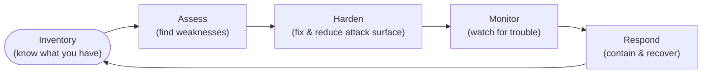
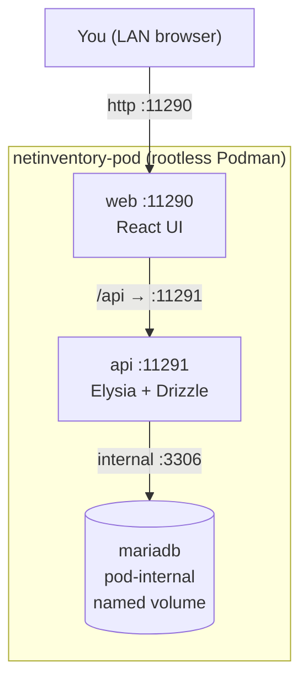

# Home Network Security — Assess & Harden (Beginner → Advanced)

A practical, vendor-neutral guide to **assessing and hardening a home / prosumer network**
against modern threats — plus a self-hosted companion web app, **NetInventory**, to record
your IP addresses, devices, subnets/VLANs, hardening status, and a live network map.

> The guide teaches you *what* to do. NetInventory gives you a place to *track* it.
> You can't defend what you can't see — so everything starts with an inventory.

---

## Who this is for

Home users and prosumers running gear like consumer routers, UniFi, OPNsense/pfSense,
Pi-hole/AdGuard, and WireGuard. No enterprise/compliance jargon. Sections are tagged by
difficulty so you can stop wherever your setup and appetite end:

- 🟢 **Beginner** — anyone with a home router can do this.
- 🟡 **Intermediate** — comfortable with a managed switch, VLANs, a dedicated firewall.
- 🔴 **Advanced** — running your own IDS/IPS, logging, and detection.

---

## The core loop

Security isn't a one-time project. It's a loop you repeat.

---

## Read in order

| # | Chapter | Level |
|---|---------|-------|
| 00 | [Overview & how to use this guide](docs/00-overview.md) | 🟢 |
| 01 | [Threat model — who attacks home networks and why](docs/01-threat-model.md) | 🟢 |
| 02 | [Network fundamentals refresher](docs/02-fundamentals.md) | 🟢 |
| 03 | [Phase 1 — Assess your network](docs/03-assess.md) | 🟢🟡 |
| 04 | [Phase 2 — Baseline hardening](docs/04-baseline-hardening.md) | 🟢 |
| 05 | [Phase 3 — Segmentation & VLANs](docs/05-segmentation.md) | 🟡 |
| 06 | [Phase 4 — Network services (DNS, NTP, mDNS)](docs/06-network-services.md) | 🟡 |
| 07 | [Phase 5 — Perimeter & remote access](docs/07-perimeter-remote-access.md) | 🟡🔴 |
| 08 | [Phase 6 — Monitoring & detection](docs/08-monitoring-detection.md) | 🔴 |
| 09 | [Phase 7 — Endpoint & supporting hygiene](docs/09-endpoint-hygiene.md) | 🟡 |
| 10 | [Phase 8 — Incident response for the home](docs/10-incident-response.md) | 🔴 |
| 11 | [Ongoing cadence & checklists](docs/11-ongoing-cadence.md) | 🟢 |

---

## The companion app — NetInventory

A local-only inventory + hardening tracker with a live, interactive network map.
It runs in a rootless Podman pod on your own hardware — nothing leaves your network.

- **Frontend:** http://localhost:11290
- **API + Swagger docs:** http://localhost:11291/docs
- **Stack:** Bun + Elysia + MariaDB/Drizzle + React/Vite/shadcn (high-contrast dark)

See [`app/`](app/) for the application and [`deploy/`](deploy/) for the Podman/systemd
(Quadlet) units. Setup instructions live in [`app/README.md`](app/README.md).

---

## A note on scope & ethics

Every assessment technique here is meant for **networks you own or are explicitly
authorized to test**. Scanning, probing, or de-authing networks you don't control is
illegal in most places. Keep it to your own LAN.
