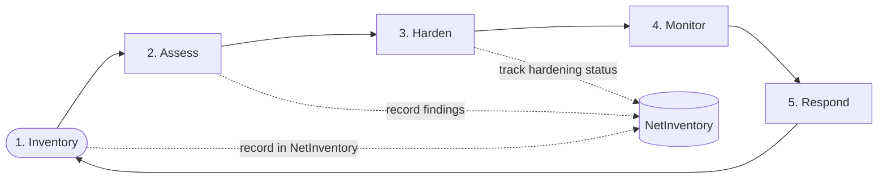

# 00 — Overview & How to Use This Guide  🟢

  

Securing a network is not a checklist you finish once. It is a **loop** you run on a
cadence. This guide walks the loop from the ground up, and the companion app
([NetInventory](../app/)) is where you record the state of your network as you go.

## Table of contents

- [The loop](#the-loop)
- [How the difficulty tags work](#how-the-difficulty-tags-work)
- [How to use NetInventory alongside the guide](#how-to-use-netinventory-alongside-the-guide)
- [What this guide is *not*](#what-this-guide-is-not)

## The loop

1. **Inventory** — list every device, IP, subnet, and service. You cannot protect what
   you do not know exists. (Chapter 03 + the app.)
2. **Assess** — find weaknesses: default creds, exposed ports, old firmware, flat
   networks. (Chapter 03.)
3. **Harden** — fix them and reduce attack surface. (Chapters 04–07, 09.)
4. **Monitor** — watch for the things you couldn't prevent. (Chapter 08.)
5. **Respond** — contain and recover when something goes wrong. (Chapter 10.)

Then repeat on a schedule (Chapter 11).

[↑ Back to top](#table-of-contents)

## How the difficulty tags work

| Tag | Meaning | Typical gear |
|-----|---------|--------------|
| 🟢 Beginner | Everyone should do this | Any home router |
| 🟡 Intermediate | Bigger payoff, more setup | Managed switch, VLAN-capable AP, dedicated firewall |
| 🔴 Advanced | For the committed | OPNsense/pfSense, IDS/IPS, syslog server |

Do **all** the 🟢 items first. They block the overwhelming majority of real-world
attacks (botnets, default-credential worms, drive-by IoT compromise). The 🟡 and 🔴
material is about depth of defense and visibility.

[↑ Back to top](#table-of-contents)

## How to use NetInventory alongside the guide

Each chapter ends with a **"Record it"** box telling you what to capture in the app.
By the time you finish, NetInventory holds:

- every **subnet / VLAN** and its trust zone,
- every **device**, its owner, type, firmware, and risk level,
- every **IP address** allocation (static / DHCP / reserved),
- the **open ports / services** you found,
- a per-device **hardening checklist**,
- a running **notes / history** trail per item, and
- a live **network map** drawn from all of the above.

[↑ Back to top](#table-of-contents)

## What this guide is *not*

- Not a guide to attacking other people's networks. Only test what you own.
- Not enterprise/compliance (no PCI, HIPAA, SOC2). It's home/prosumer-focused.
- Not product reviews. Where a tool is named, it's an example, not an endorsement.

➡️ Next: [01 — Threat model](01-threat-model.md)

[↑ Back to top](#table-of-contents)

---

🔐 Part of the **[Home Network Security guide](../README.md)** · 📦 companion app **[NetInventory](../app/)** · 📄 Licensed under **[CC BY-NC-SA 4.0](../LICENSE.md)** · © 2026
