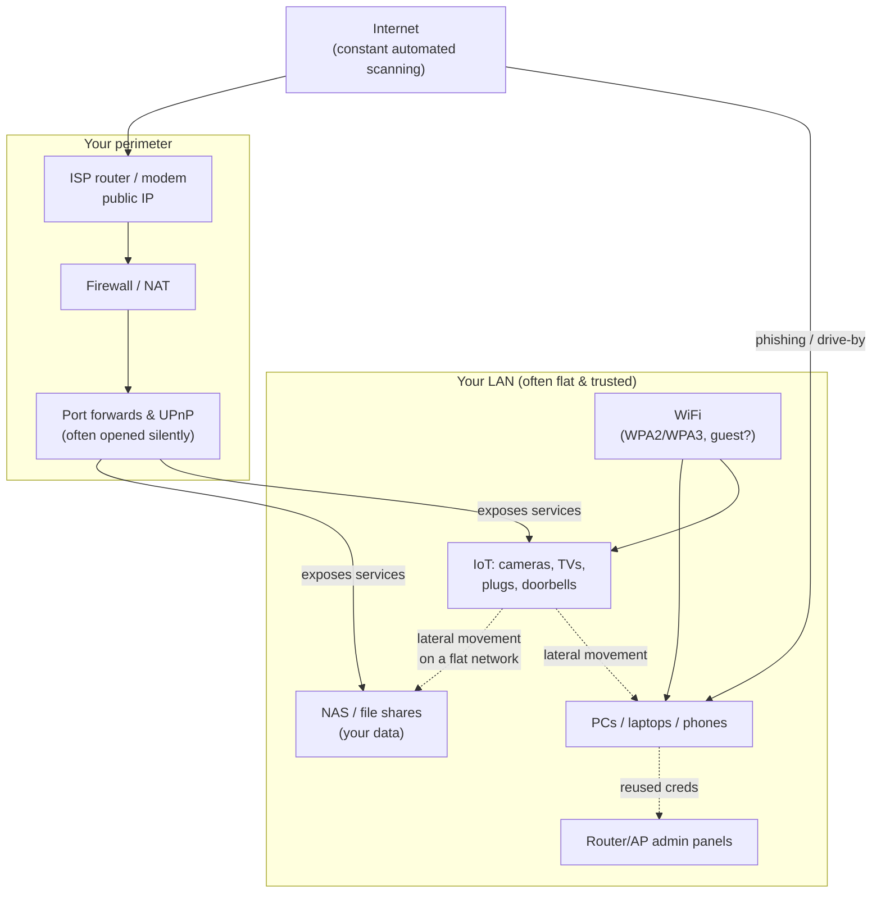

# 01 — Threat Model: Who Attacks Home Networks, and Why  🟢

  

Before you spend a minute hardening, understand what you're defending against. A home
network is **not** targeted by nation-states — but it is constantly probed by automated,
opportunistic attacks that don't care who you are. You are a number in a scan range.

## Table of contents

- [The realistic adversaries](#the-realistic-adversaries)
- [The home attack surface](#the-home-attack-surface)
- [The three failure modes that cause most home compromises](#the-three-failure-modes-that-cause-most-home-compromises)
- [Your job: write down *your* threat model](#your-job-write-down-your-threat-model)

## The realistic adversaries

| Adversary | Motivation | How they reach you |
|-----------|-----------|--------------------|
| **Botnet / worm** (Mirai-style) | Conscript IoT devices for DDoS, proxying, crypto | Scans the whole IPv4 internet for default creds & known CVEs |
| **Ransomware operator** | Extort money | Phishing → a foothold device → lateral movement to NAS/PCs |
| **Credential stuffer** | Account takeover | Reused passwords from breaches; exposed admin panels |
| **"Researcher"/scanner** | Census, resale of exposed hosts | Shodan/Censys-style mass scanning; finds your port-forwards |
| **Malicious insider / guest** | Snoop, free-ride, pivot | Your WiFi password; a device on your flat LAN |
| **Nosy neighbor** | Free internet, snooping | Weak WiFi (WEP/WPS/weak WPA2 passphrase) |
| **Compromised IoT vendor / app** | Supply-chain foothold | A camera/plug phoning home to a breached cloud |

The common thread: **opportunism and automation**. You don't have to be more secure than
everyone — just not the low-hanging fruit the scanners grab first.

[↑ Back to top](#table-of-contents)

## The home attack surface

Read the dotted lines carefully — they are the ones people forget:

- **A compromised IoT device pivots to your NAS** because everything is on one flat
  network with no segmentation. (Fixed in Chapter 05.)
- **UPnP silently opens port-forwards** so a device exposes itself to the internet
  without you knowing. (Fixed in Chapter 04/07.)
- **Reused credentials** let a phished laptop unlock the router admin panel.
  (Fixed in Chapters 04/09.)

[↑ Back to top](#table-of-contents)

## The three failure modes that cause most home compromises

1. **Default / weak credentials** — router admin, IoT devices, NAS accounts.
2. **Exposed services** — port-forwards, UPnP, IoT cloud, admin panels reachable from
   the WAN or from an untrusted segment.
3. **Flat networks** — one big LAN where a single compromised device can reach
   everything else.

Almost everything in this guide maps back to closing one of these three.

[↑ Back to top](#table-of-contents)

## Your job: write down *your* threat model

You don't need a formal document. Answer three questions and store the answers
(NetInventory's notes are a fine place):

- **What would hurt most if it were stolen or encrypted?** (Photos? Documents? The NAS?)
- **What's the most exposed thing I run?** (A port-forward? A smart camera? Remote desktop?)
- **Who uses my network that I don't fully control?** (Kids, guests, roommates, IoT.)

> **Record it:** Create a `reference` note in NetInventory titled "Threat model" with your
> three answers. Re-read it whenever you add a new device or service.

➡️ Next: [02 — Network fundamentals](02-fundamentals.md)

[↑ Back to top](#table-of-contents)

---

🔐 Part of the **[Home Network Security guide](../README.md)** · 📦 companion app **[NetInventory](../app/)** · 📄 Licensed under **[CC BY-NC-SA 4.0](../LICENSE.md)** · © 2026
