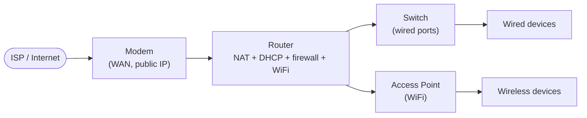
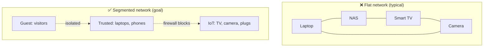

# 02 — Network Fundamentals Refresher  🟢

You don't need a CCNA to secure a home network, but a handful of concepts make
everything else click. Skim this if you already know it.

## IP addresses, subnets, CIDR

Every device on your LAN has a **private IP** (RFC 1918), usually from one of:

- `192.168.0.0/16` (home favorite, e.g. `192.168.1.0/24`)
- `10.0.0.0/8`
- `172.16.0.0/12`

The `/24` is **CIDR** notation — how many bits are the *network* part. `192.168.1.0/24`
means addresses `192.168.1.1`–`192.168.1.254` (254 usable hosts) share a network; `.255`
is broadcast, `.0` is the network address.

| CIDR | Mask | Usable hosts | Typical use |
|------|------|--------------|-------------|
| `/24` | 255.255.255.0 | 254 | A normal home VLAN |
| `/25` | 255.255.255.128 | 126 | Splitting a /24 in two |
| `/16` | 255.255.0.0 | 65,534 | Whole 192.168.x.x range |

> NetInventory stores each network as a **subnet** with its CIDR, so you can see how many
> addresses are used vs free.

## The pieces of a home network

A typical consumer "router" is actually **four devices in one box**: a router, a NAT
firewall, a DHCP server, and a WiFi access point. Prosumer setups split these apart
(modem → firewall → managed switch → separate APs), which is exactly what lets you
segment later.

## Key services, in one paragraph each

- **DHCP** hands out IP addresses automatically. Your router keeps a *lease table* — a
  great source of truth for your inventory. A **DHCP reservation** pins a device to a
  fixed IP by its MAC address (better than a manual static IP).
- **DNS** turns names (`example.com`) into IPs. Whoever runs your DNS sees every site you
  visit and can block or redirect you. This is why DNS is a security control (Chapter 06).
- **NAT** lets many private devices share one public IP. As a side effect, it blocks
  *unsolicited* inbound traffic — which is why **port-forwarding and UPnP are dangerous**:
  they punch holes through that protection.
- **Ports** identify services on a device: `:22` SSH, `:80/:443` web, `:445` SMB file
  sharing, `:3389` RDP. An "open port reachable from the internet" is an invitation.
- **MAC address** is the hardware address of a network interface. Useful for identifying
  devices; note that phones randomize MACs by default now.

## WiFi in 90 seconds

- **Bands:** 2.4 GHz (slower, longer range, used by most IoT) and 5/6 GHz (faster,
  shorter range). IoT often *requires* 2.4 GHz — relevant when you build a separate IoT
  network.
- **Encryption:** **WPA3** > **WPA2-AES** > (never) WPA2-TKIP/WEP/Open. Use WPA3 if all
  your gear supports it, else WPA2-AES, optionally a WPA2/WPA3 "transition" mode.
- **WPS** (the push-button/PIN pairing) is brute-forceable — turn it off.

## A quick map of trust

Hold this mental model for the rest of the guide. Today most homes look like the left
side; by Chapter 05 you'll move toward the right.

> **Record it:** In NetInventory, create your first **subnet** (e.g. `192.168.1.0/24`,
> zone `trusted`). You'll add more zones in Chapter 05.

➡️ Next: [03 — Assess your network](03-assess.md)
