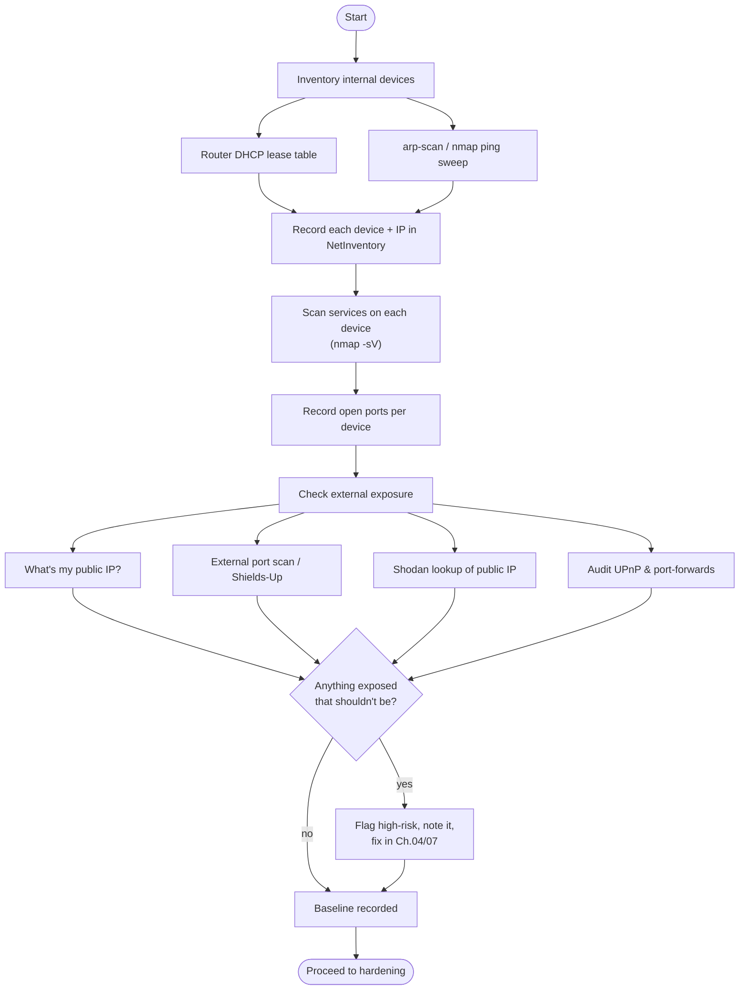

# 03 — Phase 1: Assess Your Network  🟢🟡

[](../LICENSE.md) [](../README.md) [](../app/)

> ⚠️ **Only scan networks you own or are authorized to test.** Everything below assumes
> your own LAN.

Assessment has two halves: **inventory** (what's on my network?) and **exposure** (what
can the outside world reach?). Both feed directly into NetInventory.

## Table of contents

- [The assessment workflow](#the-assessment-workflow)
- [Part A — Internal inventory](#part-a--internal-inventory)
- [Part B — External exposure](#part-b--external-exposure)
- [What "good" looks like after assessment](#what-good-looks-like-after-assessment)

## The assessment workflow




[↑ Back to top](#table-of-contents)

## Part A — Internal inventory

### 1. Start with the router's DHCP table

The easiest, zero-tools first pass: log into your router and open the **DHCP client /
lease list**. It shows hostname, IP, and MAC for everything currently connected. Copy it
out. This catches most devices but misses static-IP and powered-off ones.

### 2. Active discovery (more complete)

Run these from a machine on the LAN. Per house rules, run scanning tools **inside a
throwaway container**, not installed on the host — e.g.:

```bash
# Spin up a disposable container with scanning tools (rootless Podman, host network):
podman run --rm -it --network=host docker.io/instrumentisto/nmap -sn 192.168.1.0/24
```

- **Ping sweep (who's alive):**
  ```bash
  nmap -sn 192.168.1.0/24            # no port scan, just host discovery
  ```
- **ARP scan (catches hosts that ignore ping):**
  ```bash
  arp-scan --localnet                # needs the arp-scan package in the container
  ```
- **Identify each host (open ports + service/version):**
  ```bash
  nmap -sV -T4 192.168.1.0/24        # service & version detection
  nmap -sV -O 192.168.1.50           # add OS fingerprint for one host
  ```

For each device, capture: **IP, MAC, hostname, vendor (from MAC OUI), device type, open
ports, firmware version (if you can find it), owner, and location/room.**

> **Record it:** Add each device to NetInventory (Devices), each address (IP Addresses),
> and each discovered service (device ports). Tag obvious IoT as risk `medium`+ until
> hardened. Unknown devices you can't identify are a red flag — investigate before
> proceeding.

### 3. Find the unknowns

Anything in your scan you can't explain is the most important finding. Cross-check MAC
vendor (OUI), unplug-and-rescan to identify a device, or check the AP's client list. An
unknown device on your WiFi may mean a leaked passphrase.


[↑ Back to top](#table-of-contents)

## Part B — External exposure

This is what attackers actually see. The goal: **zero unsolicited inbound services**.

### 1. Find your public IP

From inside the LAN:
```bash
curl -s https://ifconfig.me ; echo
```
Note it (it may be dynamic). Don't post it publicly.

### 2. Scan yourself from the outside

You need a vantage point *off* your network:

- **GRC ShieldsUP!** (https://www.grc.com/shieldsup) — beginner-friendly browser test of
  common ports; aim for "all stealth/closed."
- **From a VPS / phone on cellular (not your WiFi):**
  ```bash
  nmap -Pn -T4 --top-ports 1000 <your-public-ip>
  ```
  Every open port here is a service the internet can reach. Each one must be **deliberate
  and hardened** — or closed.

### 3. Check Shodan / Censys

Search your public IP on https://www.shodan.io. If it shows banners (camera, router
admin, RTSP, RDP, databases), the internet already indexed your exposed services. This is
how opportunistic attackers find targets.

### 4. Audit UPnP and port-forwards

In your router:
- **List all port-forwarding rules.** Delete any you don't recognize or no longer need.
- **Check the UPnP/NAT-PMP table** — applications and IoT can silently open ports here.
  Unless you have a specific need, **disable UPnP entirely** (Chapter 04). Console gaming
  is the usual exception; even then, prefer manual rules.

> **Record it:** In NetInventory, add a `history` note to each exposed device describing
> what's reachable from the WAN and why. Set `risk_level = high` on anything internet-
> exposed until you've justified and hardened it. The dashboard's "high-risk" count is
> your punch list.


[↑ Back to top](#table-of-contents)

## What "good" looks like after assessment

- A complete device + IP inventory with no unknowns.
- A list of every open port, internal and external.
- **Zero** unexpected internet-facing services; UPnP off; no stale port-forwards.
- Every high-risk item has a note explaining the plan.

➡️ Next: [04 — Baseline hardening](04-baseline-hardening.md)

[↑ Back to top](#table-of-contents)

---

<sub>🔐 Part of the **[Home Network Security guide](../README.md)** · 📦 companion app **[NetInventory](../app/)** · 📄 Licensed under **[CC BY-NC-SA 4.0](../LICENSE.md)** · © 2026</sub>
