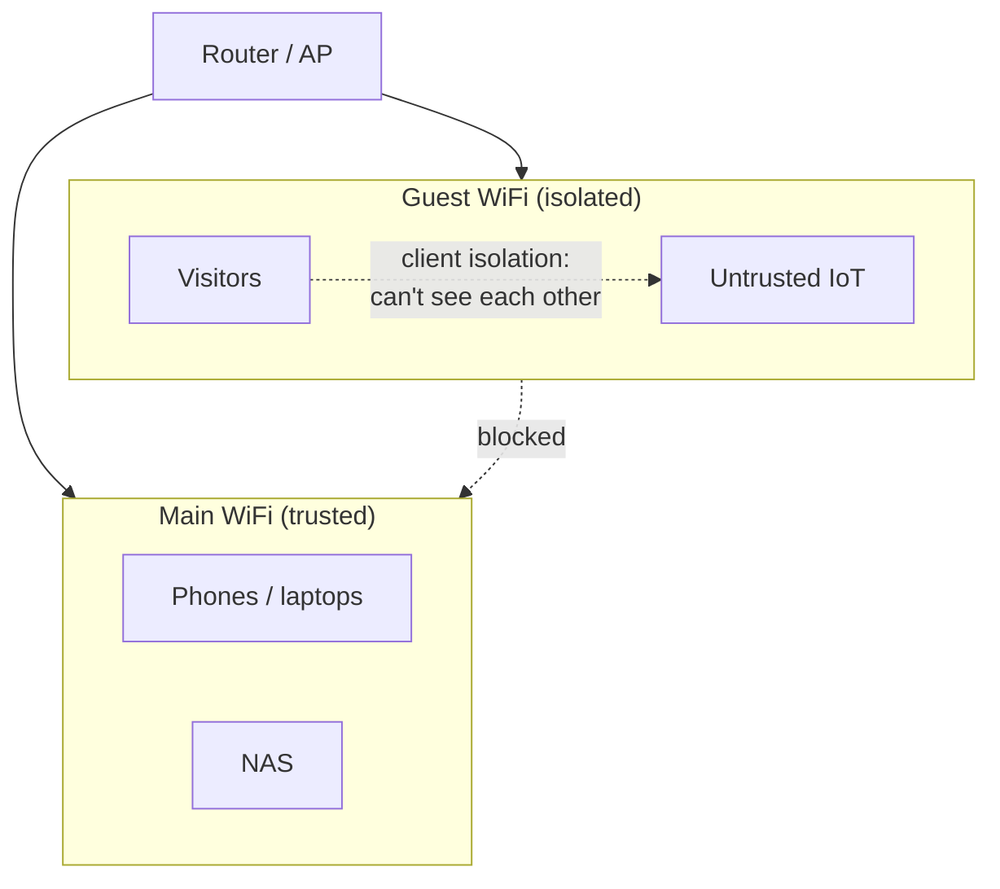

# 04 — Phase 2: Baseline Hardening  🟢

This chapter is the highest return on effort in the whole guide. None of it requires new
hardware. Do every item. It closes the three failure modes from Chapter 01 (default
creds, exposed services, weak WiFi).

## The baseline checklist

| # | Control | Why |
|---|---------|-----|
| 1 | Change the router admin password | Default creds are the #1 worm vector |
| 2 | Update router firmware; enable auto-update | Patches known CVEs attackers scan for |
| 3 | Disable WAN-side admin access | No one should reach the admin panel from the internet |
| 4 | Use WPA3 (or WPA2-AES) with a 16+ char passphrase | Stops neighbor/guest WiFi cracking |
| 5 | Disable WPS | The PIN is brute-forceable |
| 6 | Disable UPnP (unless you truly need it) | Stops devices silently exposing themselves |
| 7 | Turn off remote management protocols you don't use | Telnet, TR-069 (if optional), SNMP public |
| 8 | Create a separate Guest WiFi (with isolation) | Keeps visitors off your trusted LAN |
| 9 | Set trustworthy DNS | DNS is a filtering & privacy control (Ch.06) |
| 10 | Change default creds on **every** device | NAS, cameras, printers, IoT hubs |

### 1–3. Lock down the router itself

- Set a **unique, strong admin password** (store it in a password manager, not on a
  sticky note). If the username is changeable, change it from `admin`.
- Update firmware now, then enable **automatic updates** if available. An unpatched
  router is the single most dangerous device you own — it sees all your traffic.
- Find "Remote management / WAN access" and **disable** it. Admin should be LAN-only (and
  later, VLAN-restricted, Chapter 05).

### 4–6. WiFi hygiene

- **Encryption:** WPA3-Personal if every device supports it; otherwise WPA2-AES (CCMP).
  Never WEP, never "WPA/WPA2-TKIP," never Open (except a deliberately isolated guest net).
- **Passphrase:** 16+ characters, not a dictionary phrase. The whole "is my WiFi
  crackable" question comes down to passphrase length once you're on WPA2-AES/WPA3.
- **Turn off WPS.** Both PIN and push-button. It's a persistent weakness.
- **SSID:** a non-identifying name is fine; *hiding* the SSID provides no real security
  and breaks some devices — don't bother.

### 7. Kill unused remote protocols

Disable Telnet, unused SSH, SNMP with the `public` community string, and any vendor
"cloud" remote-access feature you don't use. Each is an attack surface.

### 8. Guest network

Enable the guest SSID and **turn on client/AP isolation** so guest devices can't see each
other or your LAN. This is "segmentation lite" for people without VLANs — and a great
place to put untrusted IoT if you can't do full VLANs yet.

### 9. DNS

Point your router's DNS at a filtering resolver (Quad9 `9.9.9.9`, Cloudflare `1.1.1.2`
for malware-blocking, or your own Pi-hole/AdGuard — Chapter 06). This blocks
known-malicious domains network-wide for free.

### 10. Every other device

Repeat "change default credentials + update firmware" on the NAS, cameras, printers,
smart-home hubs, and the IoT junk drawer. IoT is where this is skipped most and matters
most — these devices are the botnet's favorite recruits.

> **Record it:** NetInventory ships a per-device **hardening checklist** seeded with these
> controls. Mark each `done` / `pending` / `n/a` as you go. The dashboard shows your
> overall hardening completion %, so you can see the baseline reach 100%.

## Verify your work

Re-run the **external** checks from Chapter 03 (ShieldsUP! / external nmap). With UPnP off
and no stale port-forwards, the internet should see **nothing** unsolicited.

➡️ Next: [05 — Segmentation & VLANs](05-segmentation.md)
