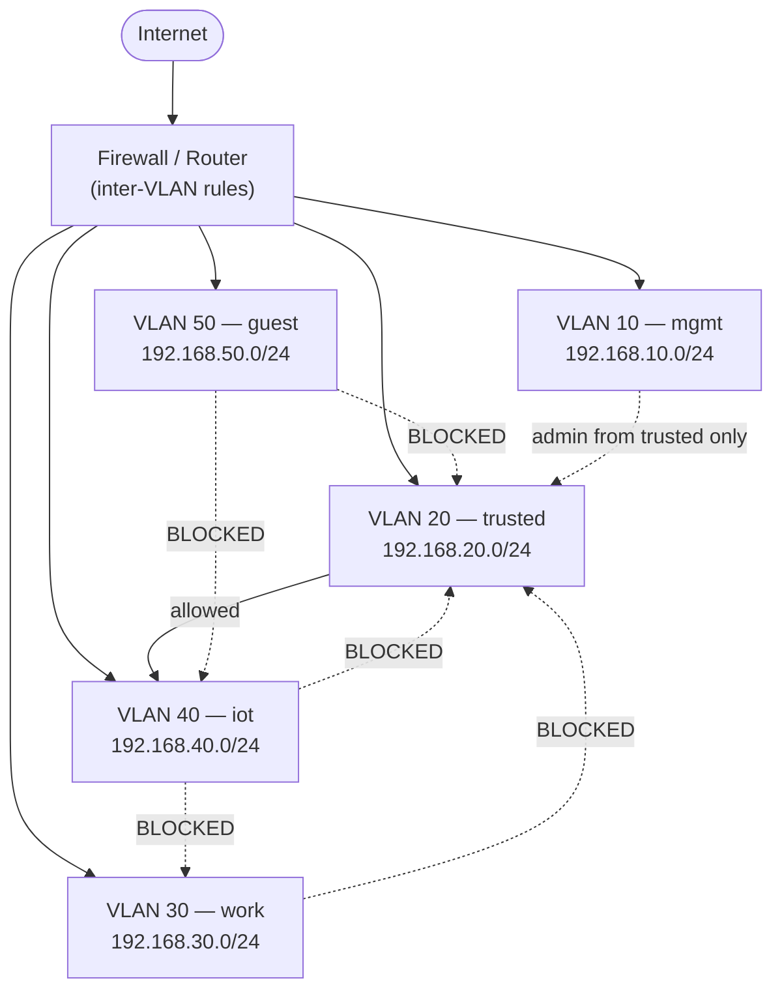

# 05 — Phase 3: Segmentation & VLANs  🟡

[](../LICENSE.md) [](../README.md) [](../app/)

The single biggest structural upgrade you can make: stop running one flat network. When
(not if) an IoT device or a guest laptop is compromised, segmentation is what stops it
from reaching your NAS, your backups, and your PCs.

## Table of contents

- [Trust zones](#trust-zones)
- [What it looks like](#what-it-looks-like)
- [How to build it](#how-to-build-it)
- [The firewall rules that matter](#the-firewall-rules-that-matter)
- [A pragmatic middle ground](#a-pragmatic-middle-ground)

## Trust zones

Decide what belongs in each zone. A practical home set:

| Zone | What lives here | Can initiate to… |
|------|-----------------|------------------|
| **mgmt** | Router, switch, AP, firewall admin | nothing (admin from trusted only) |
| **trusted** | Your laptops, phones, desktop | internet, + most other zones |
| **work** | Work laptop, sensitive workstation | internet only (isolated from home) |
| **iot** | Cameras, TVs, plugs, hubs | internet only (no LAN access) |
| **guest** | Visitors' devices | internet only |

The rule of thumb: **untrusted zones get internet and nothing else.** Trusted devices may
reach into IoT (to cast to the TV, view the camera), but IoT may **never** reach back.


[↑ Back to top](#table-of-contents)

## What it looks like




[↑ Back to top](#table-of-contents)

## How to build it

You need VLAN-capable gear: a managed switch and an AP / firewall that support **802.1Q
VLANs** and multiple SSIDs mapped to VLANs (UniFi, OPNsense/pfSense + managed switch,
OpenWrt, etc.).

1. **Create the VLANs / networks** on your router-firewall, each with its own subnet and
   DHCP scope (match the table above).
2. **Map SSIDs to VLANs:** e.g. "Home" SSID → trusted VLAN, "Home-IoT" SSID → iot VLAN,
   "Guest" SSID → guest VLAN.
3. **Tag switch ports:** trunk the uplinks, assign access ports to the right VLAN for
   wired devices (the camera PoE port → iot, your desktop → trusted).
4. **Write firewall rules** between VLANs.


[↑ Back to top](#table-of-contents)

## The firewall rules that matter

Default posture: **block inter-VLAN traffic, then allow only what's needed.**

```
# Pseudocode for inter-VLAN policy (default deny between zones)
allow  trusted -> internet
allow  trusted -> iot         (so you can control devices)
allow  iot     -> internet    (most IoT needs cloud)
block  iot     -> trusted     (the whole point)
block  iot     -> work
block  iot     -> mgmt
allow  established/related    (return traffic for allowed flows)
block  guest   -> *           (except internet)
allow  trusted -> mgmt        (admin access)
block  *       -> mgmt        (everything else)
```

Two subtleties that bite people:

- **Allow established/related return traffic**, or your "trusted → iot" rule breaks
  because replies can't come back.
- **mDNS / casting across VLANs** (Chromecast, AirPlay, printers) won't work across the
  block by default. Use an **mDNS reflector / Avahi** on the firewall scoped to just the
  zones that need it — covered in Chapter 06.


[↑ Back to top](#table-of-contents)

## A pragmatic middle ground

No managed switch yet? You still get 70% of the benefit from Chapter 04's **guest network
with isolation**: put all untrusted IoT on the isolated guest SSID. It's not as granular
as VLANs, but it breaks the flat network.

> **Record it:** In NetInventory, create a **subnet per VLAN** with its `trust_zone`, then
> reassign devices to the right subnet. The **network map** will then group and color
> devices by zone, so you can visually confirm nothing untrusted sits in `trusted`.

➡️ Next: [06 — Network services](06-network-services.md)

[↑ Back to top](#table-of-contents)

---

<sub>🔐 Part of the **[Home Network Security guide](../README.md)** · 📦 companion app **[NetInventory](../app/)** · 📄 Licensed under **[CC BY-NC-SA 4.0](../LICENSE.md)** · © 2026</sub>
