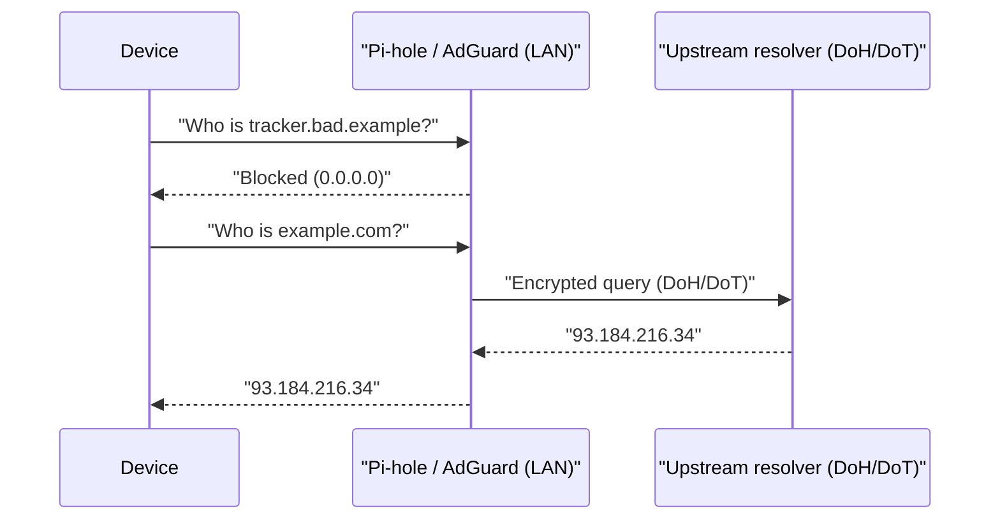

# 06 — Phase 4: Network Services (DNS, NTP, mDNS, IPv6)  🟡

These are the plumbing services that run *underneath* everything. Hardening them gives
you network-wide filtering, privacy, and fewer surprises.

## DNS — your cheapest security control

Whoever answers your DNS queries can **block malware/phishing domains, see your browsing,
and redirect you**. Run your own filtering resolver and you get the upside on your side.

### Option: Pi-hole or AdGuard Home

Run Pi-hole or AdGuard Home (on a Pi, NAS, or container), point your router's DHCP-issued
DNS at it, and it:

- blocks ads/trackers and **known-malicious domains** via blocklists,
- gives you a query log (great for spotting a chatty/compromised IoT device),
- lets you create per-client rules.

### Encrypt DNS upstream (DoH / DoT)

Configure your resolver's **upstream** to use **DNS-over-HTTPS (DoH)** or **DNS-over-TLS
(DoT)** to a trusted provider (Quad9, Cloudflare). This stops your ISP and on-path
snoopers from reading or tampering with your lookups.

### Force devices to use *your* DNS

Smart TVs and IoT often hardcode `8.8.8.8` to bypass your filtering. On a VLAN-capable
firewall, add a rule to **redirect (NAT) all outbound port 53** to your resolver, and
**block outbound DoH** to known public resolvers if you want strict control. At minimum,
block plain `:53` to anything except your resolver.

## NTP — get the time right

Accurate time matters for TLS certificate validation and for **correlating logs** during
an incident (Chapter 08/10). Let devices use your router/firewall as the NTP source, or a
reputable pool. Don't expose an open NTP server to the WAN (amplification abuse).

## mDNS / casting across VLANs

Once you segment (Chapter 05), Chromecast/AirPlay/printer discovery breaks because mDNS is
link-local and doesn't cross VLANs. Fix it **narrowly**:

- Enable an **mDNS reflector / Avahi** on the firewall **only between the trusted and IoT
  zones** (not guest), so your phone can discover the TV without flattening the network.
- Prefer per-service allow rules over "reflect everything."

## IPv6 — don't forget it exists

If your ISP provides IPv6, your devices may get **globally routable** addresses — NAT no
longer hides them. Two musts:

- Ensure your firewall applies a **default-deny inbound** policy on IPv6, just like IPv4.
  (Many setups harden IPv4 and leave IPv6 wide open.)
- Re-run your external scan (Chapter 03) against your **IPv6** address too, not just IPv4.
- Privacy extensions (temporary addresses) should be on for client devices.

> **Record it:** Add your resolver (Pi-hole/AdGuard) as a device in NetInventory, note its
> upstream (DoH/DoT) provider, and record the DNS servers on each subnet. If you add a
> port-53 redirect rule, log it as a `history` note on the firewall device.

➡️ Next: [07 — Perimeter & remote access](07-perimeter-remote-access.md)
