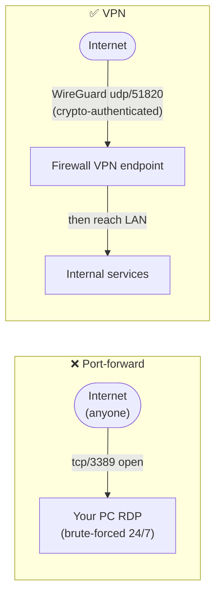

# 07 — Phase 5: Perimeter & Remote Access  🟡🔴

  

The perimeter is where the internet meets your network. The two big wins here are a
**default-deny firewall** and **never exposing services directly** — use a VPN instead.

## Table of contents

- [Upgrade the perimeter: a real firewall](#upgrade-the-perimeter-a-real-firewall)
- [The port-forward trap](#the-port-forward-trap)
- [The right way in: WireGuard](#the-right-way-in-wireguard)
- [Dynamic DNS, safely](#dynamic-dns-safely)
- [UPnP, one more time](#upnp-one-more-time)
- [Outbound matters too (egress filtering) 🔴](#outbound-matters-too-egress-filtering-)

## Upgrade the perimeter: a real firewall

Consumer router firewalls are fine for basics, but a dedicated firewall (**OPNsense** or
**pfSense** on a small appliance, or a UniFi gateway) gives you VLANs, granular rules,
IDS/IPS (Chapter 08), and proper logging. If you went through Chapter 05, you likely
already have one.

Core posture, restated: **default-deny inbound on WAN (IPv4 and IPv6)**. Nothing reaches
in unless you deliberately allow it — and the right way to "allow in" is a VPN, not a
port-forward.

[↑ Back to top](#table-of-contents)

## The port-forward trap

A port-forward exposes an internal service to the entire internet. Every exposed service
is a login prompt the world can hammer 24/7, and a CVE away from compromise. RDP, SMB,
camera web UIs, NAS admin, and "I'll just forward port 3389 for a sec" are how home
networks get ransomwared.

[↑ Back to top](#table-of-contents)

## The right way in: WireGuard

Instead of exposing services, expose **one** cryptographically authenticated VPN endpoint
and reach everything through it.

- **WireGuard** is fast, modern, and simple. Most firewalls (OPNsense, pfSense, UniFi,
  OpenWrt) support it natively; so do Tailscale/Netbird if you prefer a coordinated mesh.
- Only **udp/51820** (or your chosen port) is reachable from the WAN, and it won't even
  respond to unauthenticated packets — so it's invisible to scanners.
- Once connected, your phone/laptop behaves like it's on the LAN (or a restricted subset,
  if you scope the allowed-IPs).

> Per house rules: keep remote access **self-hosted on your own endpoint**. Avoid public
> tunneling services that expose internal apps to third-party infrastructure.

[↑ Back to top](#table-of-contents)

## Dynamic DNS, safely

Most home IPs are dynamic, so to reach your VPN endpoint by name you'll use Dynamic DNS
(DDNS). That's fine — it only resolves to your IP; it doesn't open anything. Keep the
default-deny posture; only the VPN port is open.

[↑ Back to top](#table-of-contents)

## UPnP, one more time

If you didn't already: **disable UPnP**. It exists specifically to let applications open
inbound ports without your involvement — the opposite of default-deny. The rare exception
(some game consoles/voice chat) can be handled with explicit, narrow port-forwards or by
accepting slightly stricter NAT.

[↑ Back to top](#table-of-contents)

## Outbound matters too (egress filtering) 🔴

Advanced, high-value: don't just filter inbound. Restrict **outbound** from untrusted
zones. An IoT VLAN that can only reach DNS (your resolver) + NTP + HTTPS is far less
useful to an attacker than one with unrestricted egress. Block outbound SMTP (`:25`) from
everything except a known mail host to avoid your network becoming a spam relay.

> **Record it:** Record the VPN endpoint as a device, note the single open WAN port, and
> add a `reference` note with your DDNS hostname and which clients are authorized. Confirm
> (Chapter 03 external scan) that **only** the VPN port answers.

➡️ Next: [08 — Monitoring & detection](08-monitoring-detection.md)

[↑ Back to top](#table-of-contents)

---

🔐 Part of the **[Home Network Security guide](../README.md)** · 📦 companion app **[NetInventory](../app/)** · 📄 Licensed under **[CC BY-NC-SA 4.0](../LICENSE.md)** · © 2026
