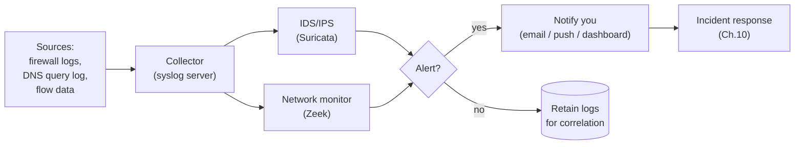

# 08 — Phase 6: Monitoring & Detection  🔴

Prevention fails eventually. Monitoring is how you find out *before* it becomes a
headline. This is the most advanced chapter; you can adopt it in layers.

## Build a baseline first

You can't spot "weird" without knowing "normal." Spend a week observing:

- Which devices talk to the internet, and roughly how much.
- What countries/ASNs your traffic goes to.
- When your network is normally quiet (3 a.m. spikes are suspicious).

NetInventory's `last_seen` and notes help you remember what each device *should* be doing.

## The detection pipeline

## Layer 1 — Logging (do this first)

- **Centralize logs.** Point your firewall, AP, and DNS resolver at a **syslog**
  collector (a small box, a container, or a NAS app). Logs scattered across devices are
  useless during an incident.
- **Keep DNS query logs** (Pi-hole/AdGuard already do this). A device suddenly resolving
  hundreds of random domains is a classic malware/DGA signal.
- **Watch firewall denies.** Repeated blocked outbound from an IoT device = that device
  trying to reach something it shouldn't.

## Layer 2 — IDS/IPS with Suricata

**Suricata** inspects traffic against rule sets (ET Open ruleset is free) and alerts on —
or in IPS mode, blocks — known-bad patterns: exploit attempts, C2 callbacks, malware
signatures.

- On OPNsense/pfSense it's a plugin; enable it on the WAN and/or inter-VLAN interfaces.
- Start in **IDS (alert-only)** mode to tune out false positives, then consider **IPS
  (block)** mode once it's quiet.
- It needs to *see* the traffic: place it where flows cross (the gateway), and remember
  encrypted traffic limits payload inspection — which is why DNS and flow metadata matter.

## Layer 3 — Network Security Monitoring with Zeek

**Zeek** (formerly Bro) doesn't signature-match; it produces rich **structured logs** of
every connection, DNS query, TLS handshake, file transfer, etc. It's the tool for
answering "what exactly did this device do?" after an alert. Pair it with Suricata:
Suricata says "something's wrong," Zeek tells you the full story.

## Layer 4 — Flow & visibility

- **NetFlow / sFlow / IPFIX** from your firewall into a collector (ntopng, Akvorado)
  shows top talkers, unusual destinations, and volume anomalies at a glance.
- A simple **bandwidth/traffic dashboard** is often enough to notice "why is the camera
  uploading 5 GB to an unknown host?"

## Alerting — close the loop

Detection with no notification is just expensive logging. Wire alerts to something you'll
actually see: email, a push notification, or a dashboard you check. Tune aggressively —
an alert channel you ignore because of noise is worse than none.

## A realistic home rollout

1. Centralize logs + keep DNS logs. (Biggest bang for the buck.)
2. Enable Suricata in IDS mode; tune for two weeks.
3. Add Zeek if you want investigation depth.
4. Add flow visibility (ntopng) for at-a-glance anomalies.
5. Switch Suricata to IPS once stable.

> **Record it:** Add your syslog/IDS host to NetInventory. When an alert fires on a
> device, add a `history` note to that device — over time you build a per-device incident
> timeline that's gold during response.

➡️ Next: [09 — Endpoint & supporting hygiene](09-endpoint-hygiene.md)
