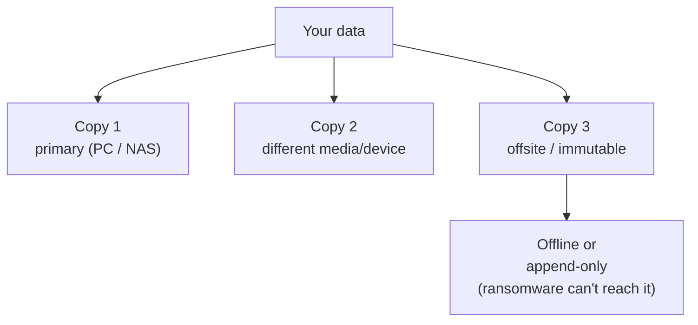

# 09 — Phase 7: Endpoint & Supporting Hygiene  🟡

The network is only as strong as the devices on it. A hardened firewall won't help if a
laptop gets phished and the attacker is already *inside* your trusted zone. These habits
are unglamorous and decisive.

## Patch everything, automatically

- Enable **automatic OS updates** on every PC, phone, and tablet.
- Enable **firmware auto-update** on router, AP, NAS, and IoT where available.
- **Replace end-of-life gear.** A router or NAS that no longer gets security updates is a
  liability no configuration can fix. Track EOL dates in NetInventory notes.

## Accounts: MFA + a password manager

- **Use a password manager** (Bitwarden/Vaultwarden self-hosted, KeePassXC, 1Password) so
  every account has a unique, strong password. Credential reuse is how one breach becomes
  many.
- **Turn on MFA** everywhere it's offered — especially email (the master key to password
  resets), your DNS/registrar, NAS, and any remote-access account. Prefer app/hardware
  tokens over SMS.
- Change **default credentials** on every device (yes, again — it's that important).

## Backups: the 3-2-1 rule

The only reliable defense against ransomware and hardware failure.

- **3** copies of important data, on **2** different media, with **1** offsite.
- At least one copy **offline or immutable** — ransomware encrypts everything it can
  reach, including network shares and many cloud syncs. An always-connected backup is not
  a backup against ransomware.
- **Test a restore.** A backup you've never restored from is a hope, not a backup.

## Browser & DNS hygiene

- Keep browsers updated; use an ad/tracker blocker (also blocks many malware domains).
- Your filtering DNS (Chapter 06) is doing quiet work here — keep blocklists fresh.
- Be ruthless about browser extensions; each is code with access to your sessions.

## The human layer: phishing

Most home compromises start with a click, not a packet. A few durable habits:

- Treat unexpected attachments and "urgent" login links as hostile until verified.
- Verify out-of-band (call the bank, don't click the email's link).
- MFA turns a stolen password into a non-event for most services.

## IoT & guest device policy

- Put untrusted IoT on the **iot** zone / isolated guest WiFi (Chapters 04–05).
- Before buying smart-home gear, check whether it still gets updates and whether it works
  **locally** (without mandatory cloud). Cloud-only devices are a standing supply-chain
  risk.
- Guests go on the **guest** network — never share your trusted passphrase.

> **Record it:** Use NetInventory's hardening checklist per device for "auto-update on,"
> "MFA on (where applicable)," and "EOL date noted." Set `risk_level = high` on any
> end-of-life device until it's replaced or isolated.

➡️ Next: [10 — Incident response](10-incident-response.md)
