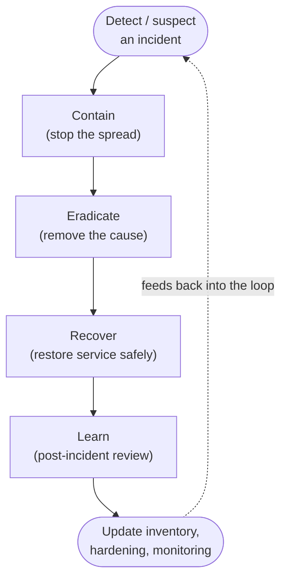

# 10 — Phase 8: Incident Response for the Home  🔴

Something looks wrong — a device you don't recognize, a ransom note, your camera
uploading gigabytes at 3 a.m. Panic makes it worse. Work the loop calmly.

## The IR loop

## 1. Detect / confirm

Signals: an unknown device on the network, an antivirus/IDS alert, files renamed/encrypted,
accounts you can't log into, a device behaving abnormally (heat, traffic, fans), or your
DNS log full of random domains.

Confirm before you nuke things — but **don't wait for certainty if data is actively being
encrypted**. When in doubt, contain.

## 2. Contain — stop the spread

Goal: cut the attacker's reach without destroying evidence you may need.

- **Isolate the affected device:** unplug its Ethernet / disable its WiFi, or move it to a
  quarantine VLAN with no LAN or internet access. Segmentation (Chapter 05) makes this a
  one-click action instead of pulling the whole network.
- **For ransomware:** disconnect network shares and backups *immediately* so it can't
  reach more. Power off the affected machine only if encryption is ongoing and you have no
  better option (it may cost forensic data, but stops the damage).
- **Rotate credentials** for anything the device could touch — from a *clean* device.
- **Preserve evidence** if you care to investigate: photograph the screen, note times,
  export relevant logs from your syslog/Zeek (Chapter 08) before they roll off.

## 3. Eradicate — remove the cause

- **Don't trust a compromised device.** For a seriously compromised PC, the reliable move
  is **wipe and reinstall** from known-good media, not "clean and hope."
- **Factory-reset compromised IoT/router**, then re-flash the latest firmware *before*
  putting it back online. If a router was compromised, treat all credentials that passed
  through it as exposed.
- **Find the entry point** (phishing email, exposed port, weak password, unpatched CVE)
  and close it — otherwise you'll be back here next week.
- **Check for persistence:** new accounts, changed DNS settings on the router, rogue
  port-forwards/UPnP entries, scheduled tasks, new firewall rules.

## 4. Recover — restore safely

- Restore data from a **known-clean backup** (Chapter 09's offline/immutable copy). Verify
  the backup predates the compromise.
- Bring devices back **one at a time**, watching your monitoring for recurrence.
- Reset MFA and re-enroll if account compromise is suspected.

## 5. Learn — close the loop

Write a short post-incident note: what happened, how it got in, what you changed. Then
update your defenses so the same path can't be reused:

- Patch/replace what was exploited.
- Tighten the segmentation or firewall rule that allowed lateral movement.
- Add a detection rule so you'd catch it faster next time.

## A pre-built "go bag"

Prepare these *before* an incident, while you're calm:

- A list of critical devices and accounts (you have this — it's NetInventory).
- Known-good install media for your main OSes.
- Offline backups you've **test-restored**.
- The admin credentials, stored in your password manager, reachable from a clean device.
- A one-page contact list (ISP, bank fraud line) in case of financial impact.

> **Record it:** Keep an incident log as `history` notes on the affected device(s) and a
> top-level `reference` note summarizing the incident and the fixes you made. Next
> assessment cycle (Chapter 11), verify those fixes held.

➡️ Next: [11 — Ongoing cadence & checklists](11-ongoing-cadence.md)
