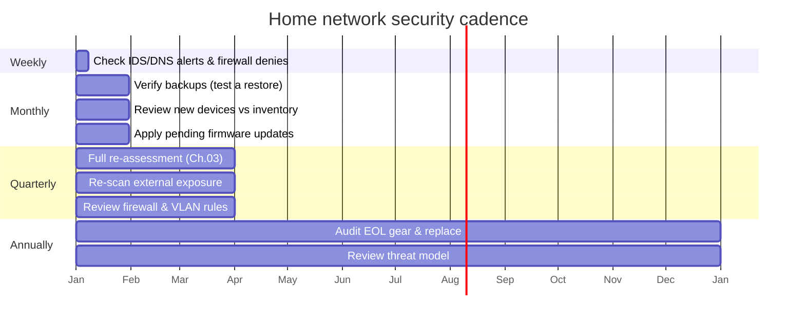

# 11 — Ongoing Cadence & Checklists  🟢

  

Security decays. New devices appear, firmware goes stale, rules drift. Put the loop on a
calendar so it actually happens. NetInventory is your source of truth between cycles.

## Table of contents

- [The cadence](#the-cadence)
- [Weekly (5 minutes)](#weekly-5-minutes)
- [Monthly (30 minutes)](#monthly-30-minutes)
- [Quarterly (a focused afternoon)](#quarterly-a-focused-afternoon)
- [Annually](#annually)
- [Using NetInventory as the system of record](#using-netinventory-as-the-system-of-record)
- [You're done (for now)](#youre-done-for-now)

## The cadence

[↑ Back to top](#table-of-contents)

## Weekly (5 minutes)

- [ ] Glance at IDS/DNS alerts and firewall deny logs (Chapter 08).
- [ ] Investigate any **unknown device** on the network.

[↑ Back to top](#table-of-contents)

## Monthly (30 minutes)

- [ ] **Test-restore** a file from backup (Chapter 09). A backup is only real if it restores.
- [ ] Reconcile the network against NetInventory — add new devices, archive retired ones.
- [ ] Apply any pending firmware/OS updates not handled automatically.
- [ ] Skim the DNS query log for chatty/suspicious devices.

[↑ Back to top](#table-of-contents)

## Quarterly (a focused afternoon)

- [ ] Re-run the **full assessment** (Chapter 03): internal scan + external exposure check.
- [ ] Confirm UPnP is still off and no stale port-forwards crept back.
- [ ] Review firewall and inter-VLAN rules — remove temporary rules that became permanent.
- [ ] Confirm hardening checklist is still 100% in NetInventory.

[↑ Back to top](#table-of-contents)

## Annually

- [ ] Audit **end-of-life** hardware; budget replacements for anything off support.
- [ ] Re-read your **threat model** (Chapter 01) — has anything changed (new work-from-home
      setup, new smart-home system, kids online)?
- [ ] Rotate critical passwords; re-check MFA coverage.

[↑ Back to top](#table-of-contents)

## Using NetInventory as the system of record

| Question | Where it lives |
|----------|----------------|
| What devices/IPs do I have? | Devices + IP Addresses |
| How is the network laid out? | Network Map |
| What's the riskiest thing right now? | Dashboard (high-risk count) |
| Is my hardening complete? | Dashboard (hardening %) + per-device checklist |
| What happened to this device over time? | Per-item notes / history |
| What changed since last quarter? | Notes timeline + archived (retired) items |

[↑ Back to top](#table-of-contents)

## You're done (for now)

Run the loop, keep the inventory honest, and you'll be well past the low-hanging fruit
that automated attacks feed on. Security isn't a finish line — it's a habit, and you now
have both the habit and the tooling.

⬅️ Back to [the guide index](../README.md) · Set up [the app](../app/)

[↑ Back to top](#table-of-contents)

---

🔐 Part of the **[Home Network Security guide](../README.md)** · 📦 companion app **[NetInventory](../app/)** · 📄 Licensed under **[CC BY-NC-SA 4.0](../LICENSE.md)** · © 2026
